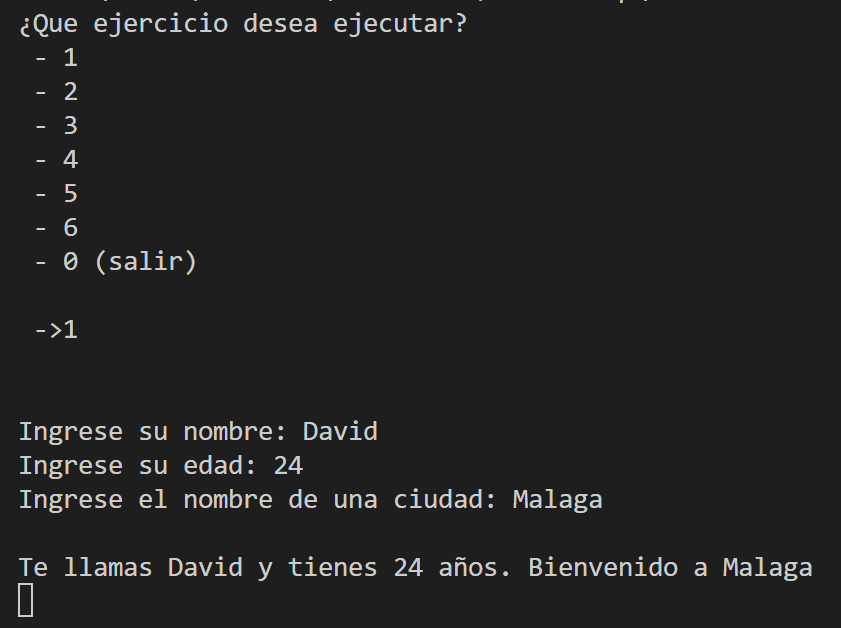
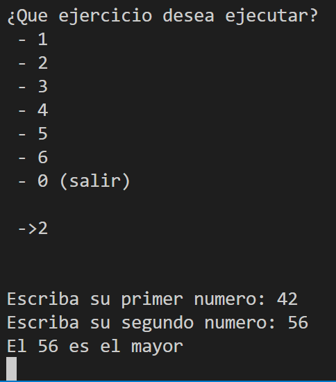
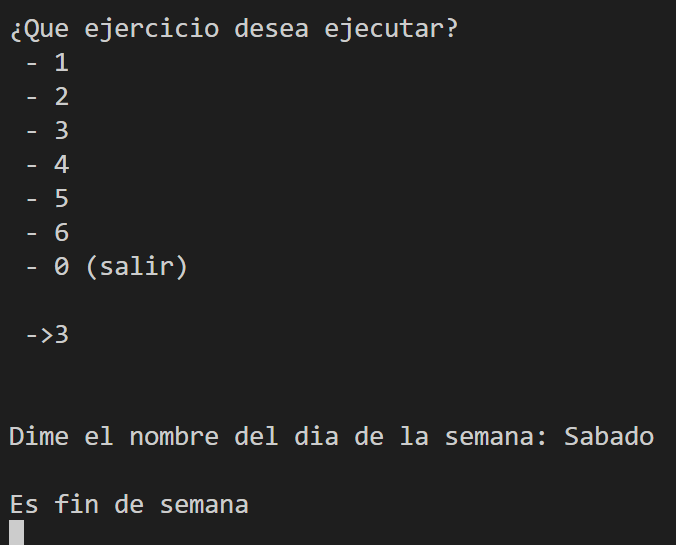
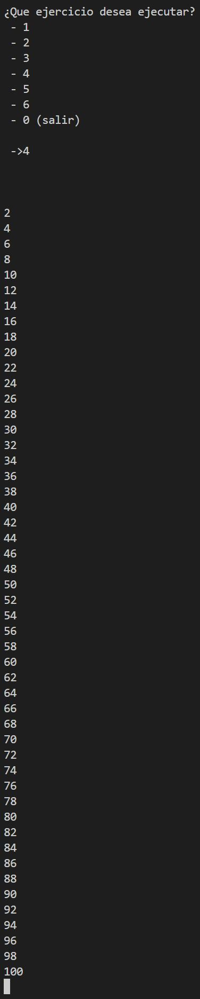
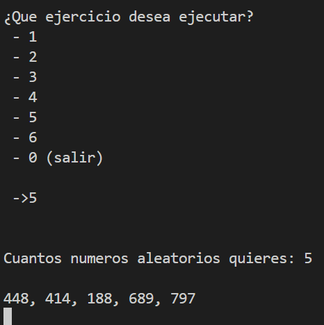
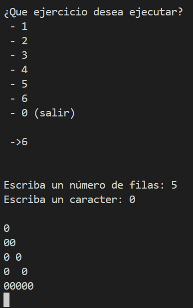

Crea una aplicación de consola por cada uno de los siguientes enunciados:

1 - Solicite el nombre de una persona, su edad y el nombre de una ciudad. Después de solicitar estos datos deberá mostrar por pantalla el siguiente mensaje: Te llamas y tienes <años> años. Bienvenido a

2 – Solicite dos números y diga cual es el mayor.

3 - Pedir el nombre de la semana al usuario y decirle si es fin de semana o no. En caso de error, indicarlo.

4 - Recorre los números del 1 al 100. Muestra los números pares. Usar el tipo de bucle que quieras.

5 – Solicitar un número al usuario y generar un Array con N números aleatorios. Por ejemplo, si el usuario introduce 4, el resultado por consola debería ser: 23, 34, 234, 11

6 – Solicitar un número al usuario y un carácter. Crear una pirámide con N filas y el carácter solicitado. Por ejemplo, si el usuario introduce 5 y * el resultado por consola debería ser:

\*
\*\*
\* \*
\*  \*
\*\*\*\*\*

