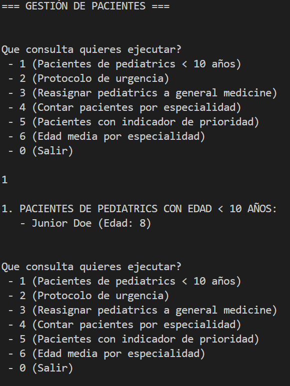
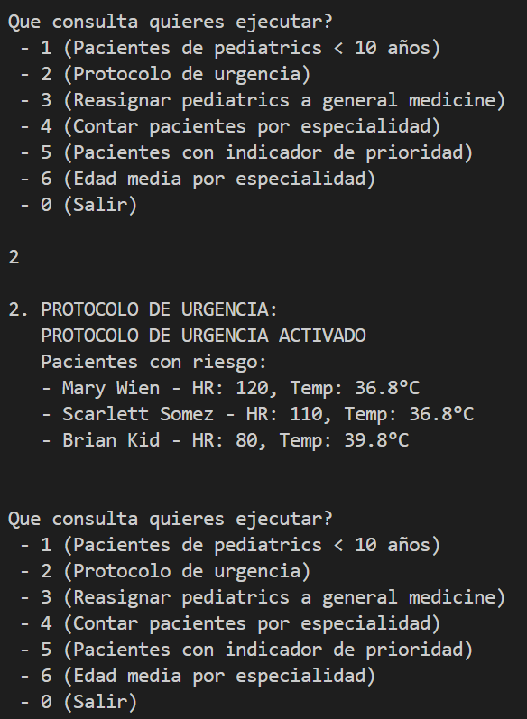
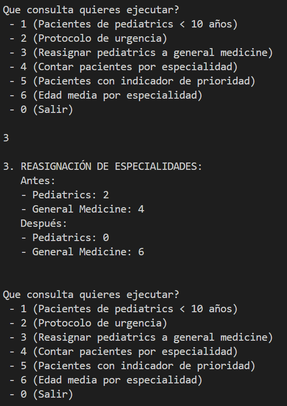
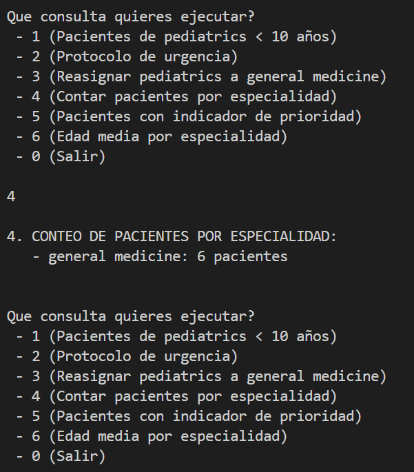
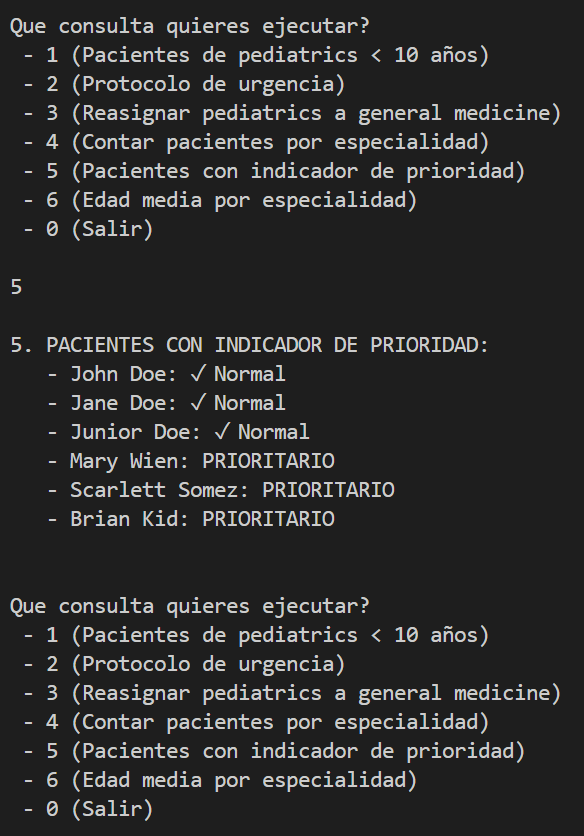
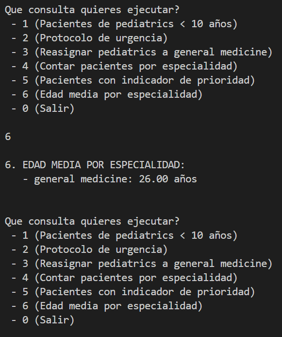

Vamos a partir de estos datos:

```c#
[
  {
    "id": 1,
    "name": "John",
    "lastname": "Doe",
    "sex": "Male",
    "temperature": 36.8,
    "heartRate": 80,
    "specialty": "general medicine",
    "age": 44,
  },
  {
    "id": 2,
    "name": "Jane",
    "lastname": "Doe",
    "sex": "Female",
    "temperature": 36.8,
    "heartRate": 70,
    "specialty": "general medicine",
    "age": 43,
  },
  {
    "id": 3,
    "name": "Junior",
    "lastname": "Doe",
    "sex": "Male",
    "temperature": 36.8,
    "heartRate": 90,
    "specialty": "pediatrics",
    "age": 8,
  },
  {
    "id": 4,
    "name": "Mary",
    "lastname": "Wien",
    "sex": "Female",
    "temperature": 36.8,
    "heartRate": 120,
    "specialty": "general medicine",
    "age": 20,
  },
  {
    "id": 5,
    "name": "Scarlett",
    "lastname": "Somez",
    "sex": "Female",
    "temperature": 36.8,
    "heartRate": 110,
    "specialty": "general medicine",
    "age": 30,
  },
  {
    "id": 6,
    "name": "Brian",
    "lastname": "Kid",
    "sex": "Male",
    "temperature": 39.8,
    "heartRate": 80,
    "specialty": "pediatrics",
    "age": 11,
  },
]
```
Como primer paso, habrá que crear la clase Patient y la colección para almacenar dichos datos.

1 - Extraer la lista de pacientes que sean de la especialidad pediatrics y que tengan menos de 10 años.



2 - Queremos activar el protocolo de urgencia si hay algún paciente con ritmo cardíaco mayor que 100 o temperatura mayor a 39.



3 - No podemos atender a todos los pacientes hoy por lo que vamos a crear una nueva coleccion y reasignar a los pacientes de pediatrics a general medicine



4 - Queremos conocer de una sola consulta el numero de pacientes que estan asignado a general medicine y a pediatrics.



5 - Devuelve una lista nueva que por cada paciente se indique si tiene prioridad o no. Se tendrá prioridad si el ritmo cardiaco es mayor 100 o la temperatura es mayor a 39.



6 - Queremos conocer de una sola consulta La edad media de pacientes asignados a pediatrics y general medicine.

